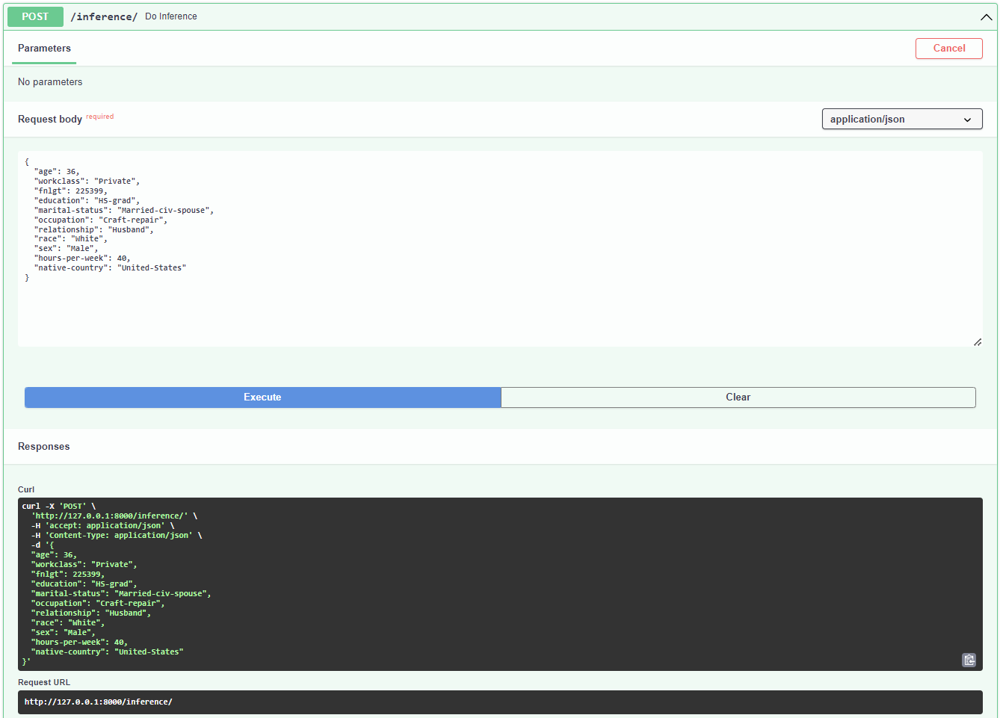

Deploying a Machine Learning Model on Heroku with FastAPI
==============================
[](https://github.com/psf/black)

- [Origin](https://github.com/HeberTU/deploy-ml-model-fastapi-heroku)
- Author: Heber Trujillo <heber.trj.urt@gmail.com>
- Date of last README.md update: 23.04.2022

## Repo Overview

This repository shows how to Deploy an end-to-end machine learning (ML) pipeline using [FastAPI](https://fastapi.tiangolo.com/) 
and [Heroku](https://dashboard.heroku.com/apps).

See [API documentation](https://census-salary-pred.herokuapp.com/docs)

The following directional graph shows the implemented ML-pipeline:


Which contains the following components:

- prepare: preprocess the census data.
- segregate: Segregates the data into test and training sets.
- train: Trains a classification inference artifact.
- evaluate: Test the fitted inference artifact. 

## How to Run Scripts 

### Dependencies Installation 

1. Create and activate a virtual environment for the project. For example:
    ```bash
    python3 -m venv ./.venv
    source ./.venv/bin/activate
    ```
   
2. Install Poetry, the tool used for dependency management. To install it, run from a terminal:
    ```bash
    pip install poetry
    ```

3. From the virtual environment, install the required dependencies with:
    ```bash
    poetry install --no-root
    ```


### Execute Pipeline

The ML-pipeline can be executed:

```bash
dvc repro
```

### Run API Locally

Type the following command to run the live server locally:

```bash
 uvicorn main:app --reload
```

#### Interactive API docs

Now go to [http://127.0.0.1:8000/docs](http://127.0.0.1:8000/docs)

You will see the automatic interactive API documentation:


## API 

### Documentation

The API has two endpoints, as shown in the [API documentation](https://census-salary-pred.herokuapp.com/docs).

#### GET - Root

The root domain contains a greeting and a helpful link where you can check the model card:


#### POST - Inference

This endpoint performs inference on new data:

