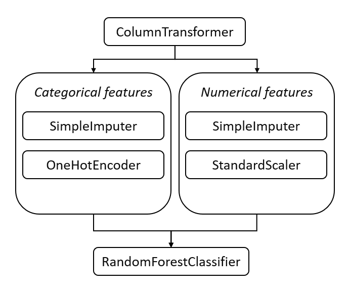

# Model Card

For additional information see the Model Card paper: https://arxiv.org/pdf/1810.03993.pdf

## Model Details

The used model is a random forest classifier; however, I chose to wrap all the preprocess components into a pipeline to guarantee reproducibility. 
The pipeline has the following structure:

## Intended Use

This model uses the socio-economic and demographic features to predict whether a person has a salary  >50K  or not.

## Training Data

The model uses and stratified sample of approximately 80% of the total records found in 
the [Census Income Data Set](https://archive.ics.uci.edu/ml/datasets/census+income).

## Evaluation Data

The model uses and stratified sample of approximately 20% of the total records found in 
the [Census Income Data Set](https://archive.ics.uci.edu/ml/datasets/census+income).

## Metrics

The evaluation metrics are:

- precision 
- recall
- f-score

## Ethical Considerations

The above metrics were calculated on data segments to anticipate any sociodemographic bias. However, due to the data 
nature, we strongly recommend increasing the diversity of sampled responders.

## Caveats and Recommendations

The data is biased based on gender and native country, this imbalance might lead to poor estimations of 
the underrepresented sectors. 